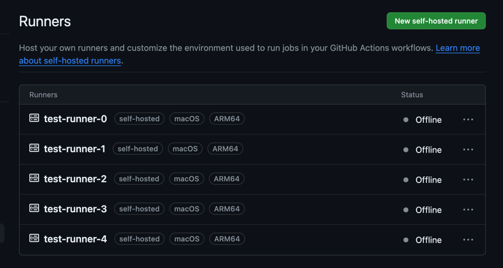
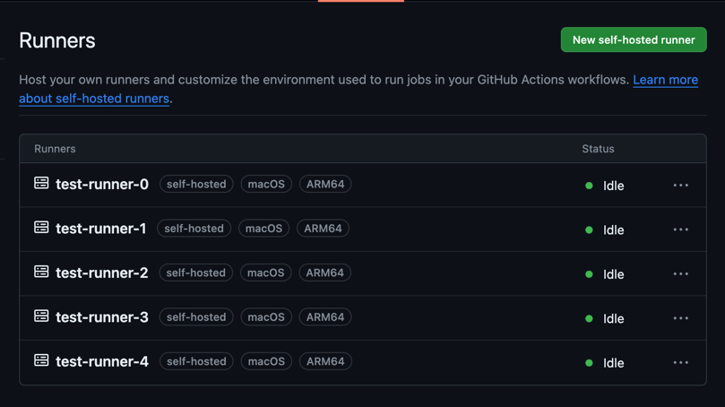

# Hello Actions Runners Starter 👋
Actions Runners Starter is a CLI tools to help you to start multiple Github Actions self-hosted runners easily.

I recommend it to someone who wants to run multiple instances at the same time.
1. Who wants to launch multiple runner hosts on one local machine
2. Who wants to set up multiple instances at the same time
3. Those who are tired of creating many folders and setting up one by one to set up multiple instances
4. If you want to run the prepared instance at once and end it at once

## Requirements
- [Go](https://golang.org/doc/install)
- OS: Linux, MacOS

## Installation
```bash
go get -u github.com/YangTaeyoung/actions-runners-starter@0.0.0
```

## Usage
1. Configure your actions runner (Github URL, Token, Runner Download URL, Number of Runners, Runner Name, Work Directory, Labels)
    > The runner name is not a required parameter when originally set to a single, but the program must enter it to distinguish each runner object.
    ```bash
    $ actions-runners-starter congigure
    ```
    P.S. Basically, Runner Download URL will be automatically set (follow the GO OS and Go Architecture), but if you want to use a specific version or there is a problem with the download URL, you can set it manually.

2. Register actions runners
    ```bash
    $ actions-runners-starter register
    ```
   
   It will create runners in your repository or organization. like below
   

3. Serve actions runners
    ```bash
    $ actions-runners-starter serve
    ```
   
   It will start the runner service. like below
   

4. Unregister actions runners
    ```bash
    $ actions-runners-starter unregister
    ```
   
   It will remove all runners in your repository or organization from actions runners starter. like below
   